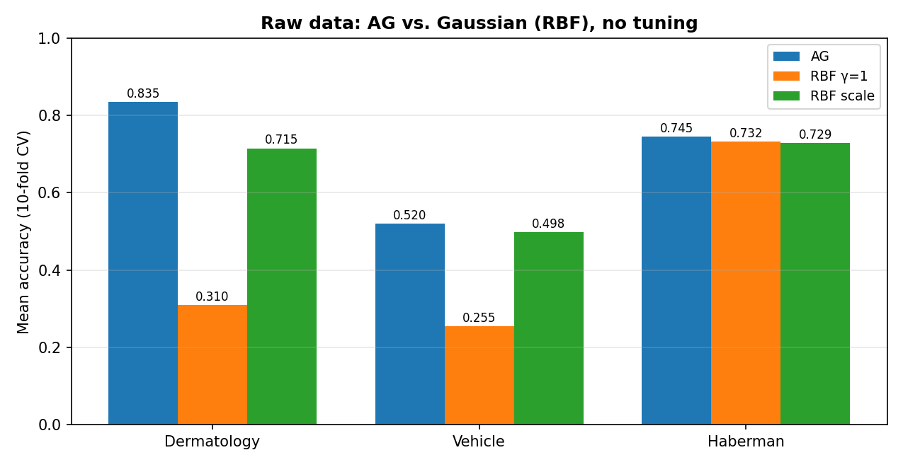
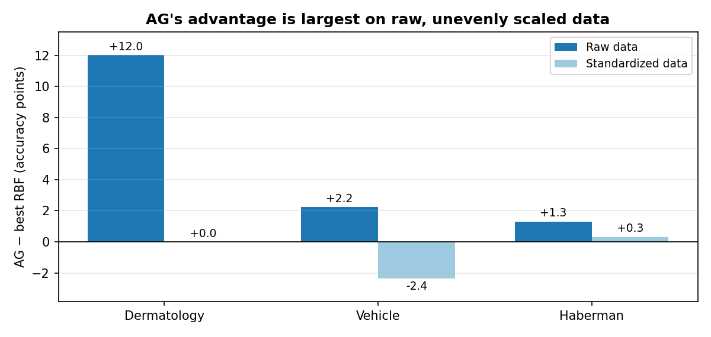
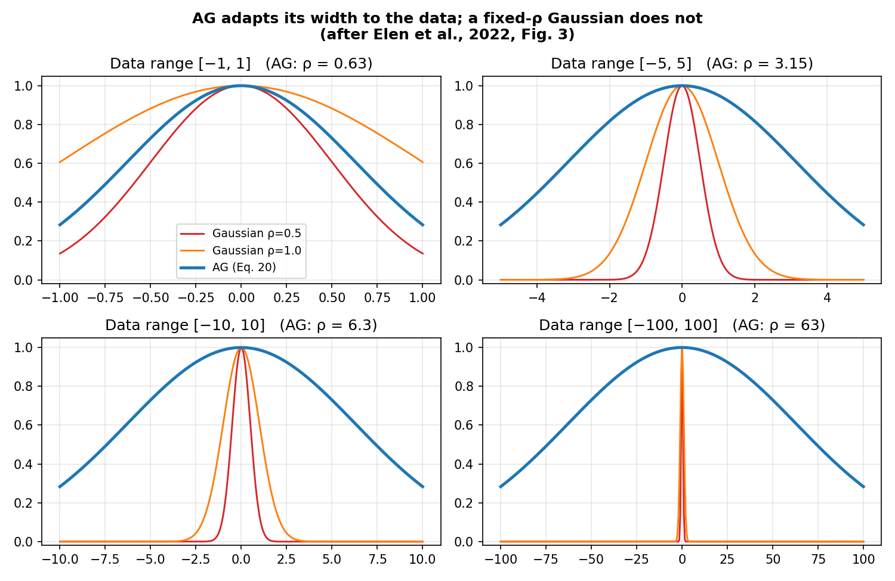
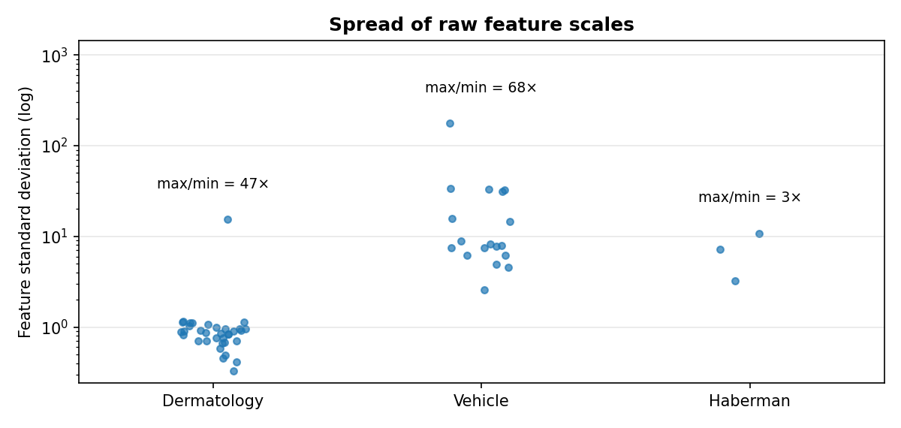

# Adaptive Gaussian (AG) Kernel

Python and MATLAB implementation of the **Adaptive Gaussian (AG)** kernel for Support Vector Machines.

> Elen, A., Baş, S., & Közkurt, C. (2022). An Adaptive Gaussian Kernel for Support Vector Machine.
> *Arabian Journal for Science and Engineering*, 47, 10579–10588.
> [https://doi.org/10.1007/s13369-022-06654-3](https://doi.org/10.1007/s13369-022-06654-3)

---

## Why AG?

The Gaussian (RBF) kernel is the default choice for nonlinear SVMs, but its accuracy hinges on a single parameter, γ (or ρ). In practice γ is picked by trial and error or by an expensive grid search, and a poor choice can push the very same kernel down to chance level.

**AG removes that choice.** It computes the kernel width directly from the training data, using the standard deviation of the pairwise squared distances. The kernel adapts to the scale of the data on its own, with no problem-specific parameter to tune.

> ### 💡 Where AG shines: raw, unevenly scaled data
>
> **AG's advantage is largest when features are used as they are, without standardization, and live on different scales.** A fixed γ is calibrated for one scale only. AG derives its bandwidth from the data's actual distance distribution, so it stays well calibrated whatever the units of the raw features. On the datasets below, AG beats the Gaussian kernel by up to **+12 accuracy points** on raw data.

## AG vs. Gaussian (RBF)

| Rule | Formula | What it looks at |
|---|---|---|
| Gaussian / RBF (Eq. 5, 15) | $K(u,v)=\exp\left(-\gamma\,\lVert u-v\rVert^2\right)$, γ chosen **by hand** | A fixed value supplied by the user |
| **AG** (Eq. 16–20) | $K_{AG}(u,v)=\exp\left(-\dfrac{\xi+\Omega}{\delta+\varepsilon}\right)$, $\gamma=\dfrac{1}{\mathrm{std}\left(\lVert u-v\rVert^2\right)}$ **automatic** | Spread of the pairwise squared distances |
| scikit-learn `gamma='scale'` | $\gamma=\dfrac{1}{p\cdot\mathrm{Var}(X)}$, automatic | Variance of all entries of the data matrix |

### Equations from the paper (Section 4)

$$K(u,v)=\exp\left(-\gamma\,\lVert u-v\rVert_2^2\right),\qquad \gamma=\frac{1}{2\rho^2} \tag{15}$$

$$K_{AG}(u,v)=\exp\left(-\frac{\lVert u-v\rVert^2-\delta\left(\lVert u-v\rVert^2\right)+\Omega}{\delta\left(\lVert u-v\rVert^2\right)}\right) \tag{16}$$

$$\Omega=\begin{cases}\left|\min\left(\lVert u-v\rVert^2-\delta(\lVert u-v\rVert^2)\right)\right|, & \min\left(\lVert u-v\rVert^2-\delta(\lVert u-v\rVert^2)\right)<0\\ 0, & \text{otherwise}\end{cases} \tag{17}$$

$$K_{AG}(u,v)=\exp\left(-\frac{\lVert u-v\rVert^2-\delta(\lVert u-v\rVert^2)+\Omega}{\delta(\lVert u-v\rVert^2)+\varepsilon}\right) \tag{18}$$

$$\xi=\lVert u-v\rVert^2-\delta\left(\lVert u-v\rVert^2\right) \tag{19}$$

$$K_{AG}(u,v)=\exp\left(-\frac{\xi+\Omega}{\delta(\lVert u-v\rVert^2)+\varepsilon}\right) \tag{20}$$

Here δ(·) is the standard deviation function and ε a negligible number that prevents division by zero.

### What makes AG distinctive

The training set contains self-pairs (‖u−u‖² = 0), so the minimum in Eq. 17 is −δ and **Ω = δ**. Eq. 20 then simplifies to

$$K_{AG}(u,v)=\exp\left(-\frac{\lVert u-v\rVert^2}{\delta+\varepsilon}\right)$$

AG is therefore a member of the Gaussian family. Its contribution is the rule that decides **which** member to use:

- **Parameter-free.** γ = 1/(δ+ε) is computed from the data. No grid search, no trial and error (paper, contributions 1–3).
- **Scale-adaptive.** The kernel width grows with the data range (Figure 1), whereas a fixed-ρ Gaussian collapses to a spike on wide ranges.
- **A different statistic.** Unlike other automatic rules such as `gamma='scale'`, AG looks at the *spread of the squared distances*, and it selects different γ values.
- **Cheap.** γ is obtained in a single pass, while a grid search retrains the model for every candidate value.

## Results

The datasets were selected to showcase the setting where AG's automatic bandwidth matters most: raw features on different scales. All three come from the [KEEL repository](https://sci2s.ugr.es/keel/datasets.php) and are among the 25 datasets used in the paper. Protocol: stratified 10-fold cross-validation, C = 1, **no tuning for any kernel**. AG is compared with the Gaussian kernel at the paper's setting (γ = 1, Section 5) and at scikit-learn's automatic default (`gamma='scale'`).

| Dataset | n | Features | Classes | Feature-scale ratio (max/min std) |
|---|---|---|---|---|
| Dermatology | 358 | 34 | 6 | 47× |
| Vehicle | 846 | 18 | 4 | 68× |
| Haberman | 306 | 3 | 2 | 3× |

### Raw data (main result)

| Dataset | **AG** | RBF γ=1 | RBF `scale` | **AG − best RBF** |
|---|---|---|---|---|
| Dermatology | **0.8352** | 0.3101 | 0.7151 | **+12.0** |
| Vehicle | **0.5201** | 0.2553 | 0.4976 | **+2.2** |
| Haberman | **0.7451** | 0.7319 | 0.7287 | **+1.3** |



### Raw vs. standardized

**Once the data are standardized, every feature is on the same scale and the Gaussian kernel's automatic default catches up.** AG's gain shrinks or disappears. This confirms that AG's strength lies in handling raw, unevenly scaled features without any preprocessing.

| Dataset | AG (std.) | RBF γ=1 (std.) | RBF `scale` (std.) | AG − best RBF |
|---|---|---|---|---|
| Dermatology | 0.9721 | 0.3101 | 0.9721 | +0.0 |
| Vehicle | 0.7566 | 0.6679 | 0.7801 | −2.4 |
| Haberman | 0.7385 | 0.7352 | 0.7353 | +0.3 |



### Kernel width adapts to the data (Fig. 3 of the paper)



On [−1, 1] AG picks ρ ≈ 0.63; on [−100, 100] it picks ρ ≈ 63. The fixed-ρ Gaussian kernels become needle-thin on wide ranges and see almost every pair of points as dissimilar.

### How unevenly scaled are the raw features?



## Implementation notes

The paper does not state explicitly over which set δ and Ω are computed. Following its remark that the offset is *"applied to the entire dataset"*, this repository:

- computes δ and Ω **once**, over **all pairs of the training set** (diagonal included), and keeps them fixed;
- therefore makes K(u, v) depend only on u and v, so the same pair always gets the same value regardless of how MATLAB or scikit-learn chunks the data;
- yields a symmetric, positive semi-definite Gram matrix (Mercer condition, Eq. 13–14 in the paper), with training and prediction using the same function;
- recomputes δ inside each cross-validation fold from that fold's training split only, so no test data leaks in.

## Installation and usage

### Python

```bash
pip install -r requirements.txt
cd python
python ag_kernel.py          # sanity checks: symmetry, PSD, equivalence to Eq. 15
python plot_comparison.py    # all figures and figures/results.md
```

```python
from ag_kernel import AGSVC, load_keel
from sklearn.model_selection import cross_val_score

X, y, _ = load_keel("../data/dermatology.dat")
clf = AGSVC(C=1.0)                         # no γ to tune
print(cross_val_score(clf, X, y, cv=10).mean())
clf.fit(X, y); print(clf.gamma_)           # γ chosen by AG: 1/(δ+ε)
```

### MATLAB

```matlab
[X, Y] = loadKeel('data/dermatology.dat');
kernelAG_setup(X);                                   % Eq. 16–18
t = templateSVM('Solver','SMO', 'KernelOffset',0, ...
                'KernelFunction','kernelAG', ...     % Eq. 20
                'Standardize',false);
mdl = fitcecoc(X, Y, 'Learners', t);
```

`matlab/example_ag.m` runs 10-fold CV on all three datasets and prints validity checks. MATLAB uses its own CV splits and solver, so its numbers may differ slightly from the Python results.

## Repository structure

```
adaptive-gaussian-kernel/
├── README.md
├── CITATION.cff
├── requirements.txt
├── data/                     # KEEL datasets
│   ├── dermatology.dat
│   ├── vehicle.dat
│   └── haberman.dat
├── python/
│   ├── ag_kernel.py          # ag_parameters, ag_kernel, AGSVC, load_keel (Eq. 16–20)
│   └── plot_comparison.py    # Figures 1–4 and results table
├── matlab/
│   ├── kernelAG_setup.m      # δ, Ω, ε (Eq. 16–18)
│   ├── kernelAG.m            # K_AG (Eq. 20)
│   ├── loadKeel.m            # KEEL .dat reader
│   └── example_ag.m          # 10-fold CV on the three datasets
└── figures/
    ├── fig1_kernel_curves.png
    ├── fig2_feature_scales.png
    ├── fig3_accuracy_raw.png
    ├── fig4_raw_vs_std.png
    └── results.md
```

## Citation

If you use this kernel, please cite the original paper:

**APA**

> Elen, A., Baş, S., & Közkurt, C. (2022). An Adaptive Gaussian Kernel for Support Vector Machine. *Arabian Journal for Science and Engineering, 47*(8), 10579–10588. https://doi.org/10.1007/s13369-022-06654-3

**BibTeX**

```bibtex
@article{elen2022adaptive,
  title   = {An Adaptive Gaussian Kernel for Support Vector Machine},
  author  = {Elen, Abdullah and Ba{\c{s}}, Sel{\c{c}}uk and K{\"o}zkurt, Cemil},
  journal = {Arabian Journal for Science and Engineering},
  volume  = {47},
  number  = {8},
  pages   = {10579--10588},
  year    = {2022},
  doi     = {10.1007/s13369-022-06654-3}
}
```

The datasets are from the KEEL repository:

> Alcalá-Fdez, J., Fernández, A., Luengo, J., Derrac, J., García, S., Sánchez, L., & Herrera, F. (2011). KEEL Data-Mining Software Tool: Data Set Repository, Integration of Algorithms and Experimental Analysis Framework. *Journal of Multiple-Valued Logic and Soft Computing*, 17, 255–287.
